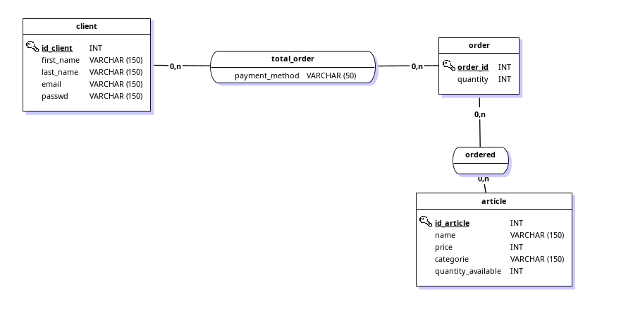

> Judicaël J1 STD23098 \
> Rado J1 STD23099

# EXO1: Fonctions d’agrégation

### Voici le MCD pour la base de donnée



__1. La base de donnée pour le magasin en ligne__

```SQL
create table client(
  id_client 	int primary key,
  first_name 	varchar(150),
  last_name 	varchar(150),
  email 	varchar(150),
  passwd 	varchar(150)
);

create table article(
  id_article 	int primary key,
  name 		varchar(150),
  price 	int,
  category 	varchar(150),
  quantity_available int
);

create table "order"(
  id_order 	int primary key,
  quantity 	int
);

create table ordered(
  id_ordered 	int primary key,
  id_article 	int,
  id_order 	int,
  constraint fk_order foreign key (id_order) references "order"(id_order),
  constraint fk_article foreign key (id_article) references article(id_article)
);

create table total_order(
  id_total_order 	int primary key,
  payment_method 	varchar(50),
  id_client 		int,
  id_order 		int,
  constraint fk_client foreign key(id_client) references client(id_client),
  constraint fk_total_order foreign key(id_order) references "order"(id_order)
);
```
2. Insertion de données fictives, notamment Ratoko qui a acheté 5 yaourt

```SQL

--INSERT FICTIF
INSERT INTO client (id_client, first_name, last_name, email, passwd) 
VALUES
(1, 'John', 'Doe', 'john.doe@example.com', 'password1'),
(2, 'Alice', 'Smith', 'alice.smith@example.com', 'password2'),
(3, 'Bob', 'Johnson', 'bob.johnson@example.com', 'password3'),
(4, 'Emily', 'Brown', 'emily.brown@example.com', 'password4'),
(5, 'Michael', 'Wilson', 'michael.wilson@example.com', 'password5'),
(6, 'Sophia', 'Lee', 'sophia.lee@example.com', 'password6'),
(7, 'William', 'Anderson', 'william.anderson@example.com', 'password7'),
(8, 'Olivia', 'Martinez', 'olivia.martinez@example.com', 'password8'),
(9, 'James', 'Taylor', 'james.taylor@example.com', 'password9'),
(10, 'Emma', 'Thomas', 'emma.thomas@example.com', 'password10');


INSERT INTO article (id_article, name, price, category, quantity_available) 
VALUES
(1, 'T-shirt', 15, 'Clothing', 100),
(2, 'Jeans', 30, 'Clothing', 50),
(3, 'Sneakers', 50, 'Footwear', 75),
(4, 'Backpack', 40, 'Accessories', 30),
(5, 'Watch', 100, 'Accessories', 20),
(6, 'Dress', 45, 'Clothing', 80),
(7, 'Hat', 20, 'Accessories', 60),
(8, 'Jacket', 70, 'Clothing', 40),
(9, 'Boots', 60, 'Footwear', 25),
(10, 'Sunglasses', 25, 'Accessories', 35);


INSERT INTO "order" (id_order, quantity) 
VALUES
(1, 2),
(2, 3),
(3, 1),
(4, 4),
(5, 2),
(6, 3),
(7, 1),
(8, 5),
(9, 2),
(10, 3);


INSERT INTO ordered (id_ordered, id_article, id_order) 
VALUES
(1, 1, 1),
(2, 2, 2),
(3, 3, 3),
(4, 4, 4),
(5, 5, 5),
(6, 6, 6),
(7, 7, 7),
(8, 8, 8),
(9, 9, 9),
(10, 10, 10);

INSERT INTO total_order (id_total_order, payment_method, id_client, id_order) 
VALUES
(1, 'Credit Card', 1, 1),
(2, 'PayPal', 2, 2),
(3, 'Credit Card', 3, 3),
(4, 'PayPal', 4, 4),
(5, 'Credit Card', 5, 5),
(6, 'PayPal', 6, 6),
(7, 'Credit Card', 7, 7),
(8, 'PayPal', 8, 8),
(9, 'Credit Card', 9, 9),
(10, 'PayPal', 10, 10);

--insertion de Rakoto
-- Ajout de l'article "Yaourt"
INSERT INTO article (id_article, name, price, category, quantity_available) 
VALUES (11, 'Yaourt', 2, 'Food', 100);

-- Ajout du client Rakoto
INSERT INTO client (id_client, first_name, last_name, email, passwd) 
VALUES (11, 'Rakoto', 'Rakoto', 'rakoto@example.com', 'motdepasse');

-- Ajout de l'achat des yaourts
INSERT INTO "order" (id_order, quantity) 
VALUES (11, 5);

INSERT INTO ordered (id_ordered, id_article, id_order) 
VALUES (11, 11, 11);

-- Ajout des informations sur la commande totale
INSERT INTO total_order (id_total_order, payment_method, id_client, id_order) 
VALUES (11, 'Mvola', 11, 11);

```
3. 
- On veut faire la pub de la diversité des articles : afficher le nombre d’articles dans la base de données.

```SQL
select count(*) from article;
```
 - Afficher en même temps
le prix unitaire le moins cher, et le prix unitaire le plus cher

```SQL
select category, MIN(price) as prix_unitaire_min, MAX(price) as prix_unitaire_max from article group by category;
```
-  Afficher chaque commande de Rakoto avec notamment le prix total payé par commande

```SQL
select
    o.id_order,
    a.name as article_name,
    a.price as prix_unitaire,
    o.quantity,
    (a.price * o.quantity) as prix_total,
    t.payment_method
from
    total_order t
join
    "order" o on t.id_order = o.id_order
join
    ordered od on o.id_order = od.id_order
join
    article a on od.id_article = a.id_article
join
    client c on t.id_client = c.id_client
join
    c.first_name = 'Rakoto';
```
- Quels produits se vendent bien ? pour le savoir: affichez chaque nom d’article, avec la quantité totale
vendue pour celle-ci.

```SQL
select sum(quantity) as total_quantity, name from "order", article inner join ordered on ordered.id_article = article.id_article group by article.name order by total_quantity desc;
```
- Combien on a gagné cette année ? Pour le savoir: affichez le total des commandes payées pour cette
année ci.

```SQL
select count(*) from ordered;
```

# Exo 2 : Vues et index basiques

```SQL
CREATE TABLE user (
    user_id SERIAL PRIMARY KEY,
    first_name VARCHAR(50),
    last_name VARCHAR(50),
    age INT,
    email VARCHAR(100)
);

CREATE TABLE post (
    post_id SERIAL PRIMARY KEY,
    user_id INT REFERENCES user(user_id),
    content TEXT,
    created_at TIMESTAMP DEFAULT CURRENT_TIMESTAMP
);

CREATE INDEX idx_user_first_name ON user (first_name);


CREATE VIEW list_post_user AS
SELECT 
    u.last_name,
    u.first_name,
    u.age,
    u.email,
    COUNT(p.post_id) AS post_count
FROM 
    "user" u
LEFT JOIN 
    post p ON u.user_id = p.user_id
GROUP BY 
    u.last_name, u.first_name, u.age, u.email;
    
    
INSERT INTO "user" (first_name, last_name, age, email) VALUES ('Alice', 'Dupont', 18, 'alice@example.com');
INSERT INTO "user" (first_name, last_name, age, email) VALUES ('Bob', 'Martin', 25, 'bob@example.com');
INSERT INTO "user" (first_name, last_name, age, email) VALUES ('Charlie', 'Brown', 22, 'charlie@example.com');
INSERT INTO "user" (first_name, last_name, age, email) VALUES ('David', 'Smith', 30, 'david@example.com');
INSERT INTO "user" (first_name, last_name, age, email) VALUES ('Emma', 'Johnson', 17, 'emma@example.com');

INSERT INTO post (user_id, content) VALUES (1, 'Premier post !');
INSERT INTO post (user_id, content) VALUES (1, 'Deuxième post.');
INSERT INTO post (user_id, content) VALUES (2, 'Un autre post.');
INSERT INTO post (user_id, content) VALUES (3, 'Bonjour tout le monde !');
INSERT INTO post (user_id, content) VALUES (4, 'Dernier post pour aujourd''hui.');

SELECT *
FROM user_post_count_view
WHERE age < 20 AND post_count > 0;


SELECT 
    u.last_name,
    u.first_name,
    u.age,
    u.email,
    COUNT(p.post_id) AS post_count
FROM 
    "user" u
LEFT JOIN 
    post p ON u.user_id = p.user_id
WHERE 
    u.age < 20
GROUP BY 
    u.last_name, u.first_name, u.age, u.email
HAVING 
    COUNT(p.post_id) > 0;
```
